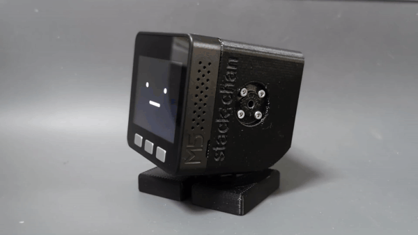

# サンプルMOD

ｽﾀｯｸﾁｬﾝのユーザアプリケーション（MOD）のサンプル集です。
MODの書き込み方法は[プログラムのビルドと書き込み](../docs/flashing-firmware_ja.md)を参照ください。

一部のMODは動かすためにネットワーク接続や外部のサーバなどを準備を準備する必要があります。

## Look Around: きょろきょろｽﾀｯｸﾁｬﾝ

    - 環境設定時のAボタンに入っている動作と同じです。
    - modのインストール方法
        - ホストのビルド時に、Wi-Fiの設定はは不要です。
            - $ npm run build --target=esp32/m5stack_cores3
        - ビルドをした場合は、ホストのプログラムを書き込みます。
            -  $ npm run deploy --target=esp32/m5stack_cores3
        - modの書き込み
            - $ npm run mod --target=esp32/m5stack_cores3 ./mods/look_around/manifest.json
- [look_around](./look_around/)

## Monologue: ぽしょぽしょ独り言ｽﾀｯｸﾁｬﾝ

- [monologue](./monologue/)

## Cheerup: ｽﾀｯｸﾁｬﾝ応援団

- [cheerup_ble_lite](./cheerup_ble_lite/): BLE版
- [cheerup_ws](./cheerup_ws/): WebSocket版

## Mimic: まねっこｽﾀｯｸﾁｬﾝ

- [mimic_main](./mimic_main/): ユーザが動かすほう
- [mimic_follow](./mimic_follow/): まねして動くほう

## Face Tracker: 顔を追いかけるｽﾀｯｸﾁｬﾝ

- [M5Stack UnitV2](https://docs.m5stack.com/en/unit/unitv2)が別途必要になります。
- UnitV2のデータをWi-Fiに載せてスタックチャンに転送しますので、ホストのビルド時にWi-Fiの設定が必要になります。

- [face_tracker](./face_tracker/)
